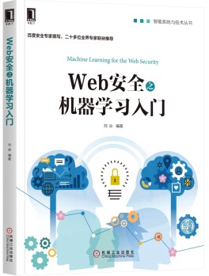
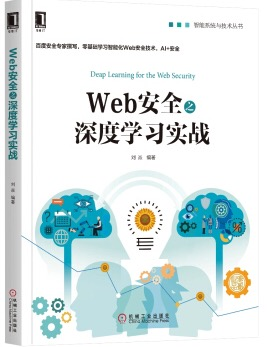
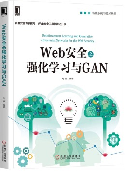
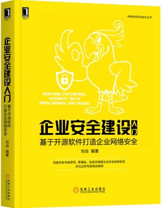
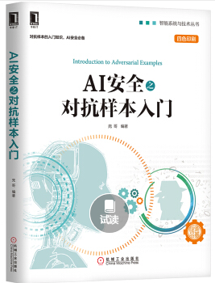

# 欢迎来到兜哥主页

 

# 个人简介

兜哥，百度安全实验室AI模型安全负责人，具有10余年安全从业经历，曾任百度基础架构安全负责人，web安全产品线负责人。研究方向集中在web安全与AI安全，多次在国内外著名安全会议发表演讲。开源应用自防护项目openrasp以及AI安全工具箱advbox负责人。畅销AI安全书籍《web安全之机器学习入门》《web安全之深度学习实战》《web安全之强化学习与GAN》《AI安全之对抗样本入门》作者。多次在国内外重要安全会议Defcon、ISC、OWASP、C3、NSC、XCON、SSC上发表演讲，拥有十余项AI安全专利。
ORCID iD is https://orcid.org/0000-0002-6021-1358.
Public author identifier is http://arxiv.org/a/goodman_d_1 

Liu Yan（兜哥），Head of AI security team of Baidu Xlab , Famous technology writer of Machine learning for the web security,Deep learning for the web security,Reinforcement learning and GANs for the web security.He has delivered speeches on Defcon, ISC, OWASP,C3, NSC and 、XCON、SSC at many important security conferences at home and abroad, and has more than ten AI security patents.ORCID iD is https://orcid.org/0000-0002-6021-1358.
Public author identifier is http://arxiv.org/a/goodman_d_1 

# 主要采访

 - [安全大咖兜哥：机器学习为网络安全推开一扇窗](http://dy.163.com/v2/article/detail/DK1QRM9U0511DM95.html)
 - [人物- 兜哥：兜哥和他的AI安全三部曲](http://dy.163.com/v2/article/detail/DK1QRM9U0511DM95.html)
 - [兜哥丛书 Web安全系列 AI安全的攻与防](https://www.anquanke.com/subject/id/102542)

# 主要会议演讲

- [OWASP 2016 《Cloud-ids：智能Web入侵检测与威胁感知》](http://www.owasp.org.cn/OWASP_Conference/owasp-2016/jb/)
- [中国电子信息技术年会 2017 《骨干网大规模DDoS智能检测与对抗》](http://news.ifeng.com/a/20170802/51550518_0.shtml)
- [SSC 2017 《智能检测与响应系统实践》](https://doc.huodongjia.com/detail-6885.html)
- [FIT 2018 《强化学习在Web安全领域的应用探索》](http://www.freebuf.com/news/153504.html)
- [中国安卓开发者大会 2018 《AI模型的脆弱性以及常见攻击方法》](https://new.qq.com/omn/20180713/20180713A1CZM4.html)
- [中国人工智能移动安全高峰论坛 2018 《AI时代的攻与防》](http://www.isc.org.cn/zxzx/xhdt/listinfo-36079.html)
- [ISC 2018 《深度学习模型的脆弱性检测与加固》](http://www.ctoutiao.com/955145.html)
- [XCON 2018 《AI模型安全以及攻击工具箱AdvBox》](https://www.anquanke.com/post/id/157195)
- [第二届电子数据取证前瞻技术高端论坛 《感知欺骗：基于深度神经网络（DNN）下物理性对抗攻击与策略》](http://www.sohu.com/a/290379636_100012570)
- [网络安全国际(InForSec)四大会议论文分享及产学对话 《感知欺骗：基于深度神经网络（DNN）下物理性对抗攻击与策略》](http://www.inforsec.org/wp/?p=2949)
- [Defcon China 2019  Transferability of Adversarial Examples to Attack Cloud-based Image Classifier Service](https://www.defcon.org/html/dc-china-1/dc-cn-1-speakers.html) 
- [Defcon China 2019  Face Swapping Video Detection with CNN ](https://www.defcon.org/html/dc-china-1/dc-cn-1-speakers.html) 
- [NSC 2019 迁移攻击云端AI服务：一个被遗忘的战场](https://www.csdn.net/article/a/2019-06-14/15975640)
- [COMMSEC: Tracking Fake News Based On Deep Learning. HITB GSEC 2019](https://gsec.hitb.org/sg2019/sessions/commsec-tracking-fake-news-based-on-deep-learning/)
- [COMMSEC: Hacking Object Detectors Is Just Like Training Neural Networks. HITB GSEC 2019](https://gsec.hitb.org/sg2019/sessions/commsec-hacking-object-detectors-is-just-like-training-neural-networks/)
- [COMMSEC: How to Detect Fake Faces (Manipulated Images) Using CNNs. HITB GSEC 2019](https://gsec.hitb.org/sg2019/sessions/commsec-how-to-detect-fake-faces-manipulated-images-using-cnns/)
- [Cloud-based Image Classification Service Is Not Robust To Affine Transformation : A Forgotten Battlefield. CCSW 2019: The ACM Cloud Computing Security Workshop of CCS 2019](https://ccsw.io/#speakers)

# 主要作品

## 《web安全之机器学习入门》
 
 
 
## 《web安全之深度学习实战》 
  
 
## 《web安全之强化学习与GAN》
 
  
 
## 《企业安全建设入门:基于开源软件打造企业网络安全》
 
  
  
## 《AI安全之对抗样本入门》  
 
  

# 主要开源项目
 
## AdvBox
 
 
 
 [https://github.com/baidu/AdvBox](https://github.com/baidu/AdvBox)
 
## OpenRASP

 [https://github.com/baidu/openrasp](https://github.com/baidu/openrasp) 

# 微信公众号

兜哥带你学安全

# 主要专利

- CN201910138054.7
- CN201910138706.7
- CN201910187998.3
- CN201910189445.1
- CN201910189316.2
- CN201910204167.2
- CN201910204138.6
- CN201910140315.9

# orcid

<a itemprop="sameAs" content="https://orcid.org/0000-0002-6021-1358" href="https://orcid.org/0000-0002-6021-1358" target="orcid.widget" rel="noopener noreferrer" style="vertical-align:top;">https://orcid.org/0000-0002-6021-1358</a>

